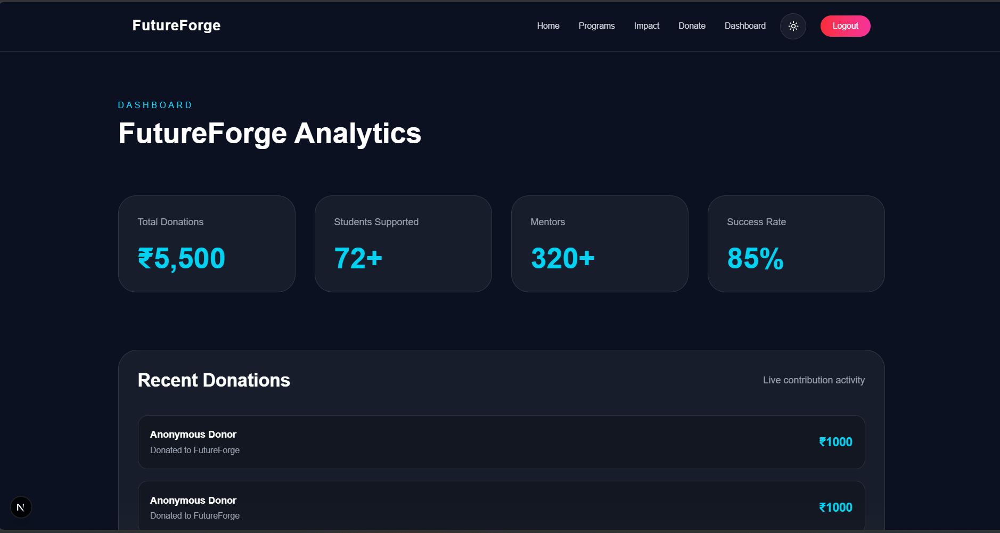
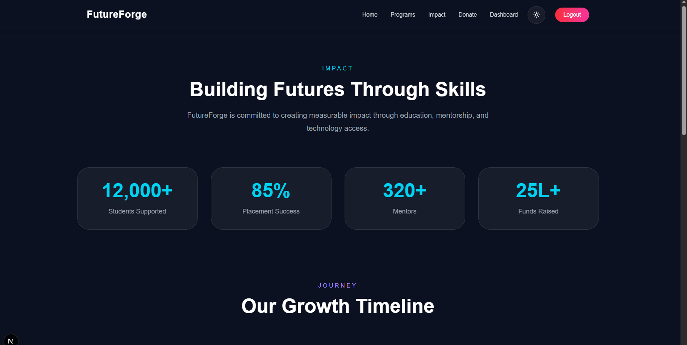
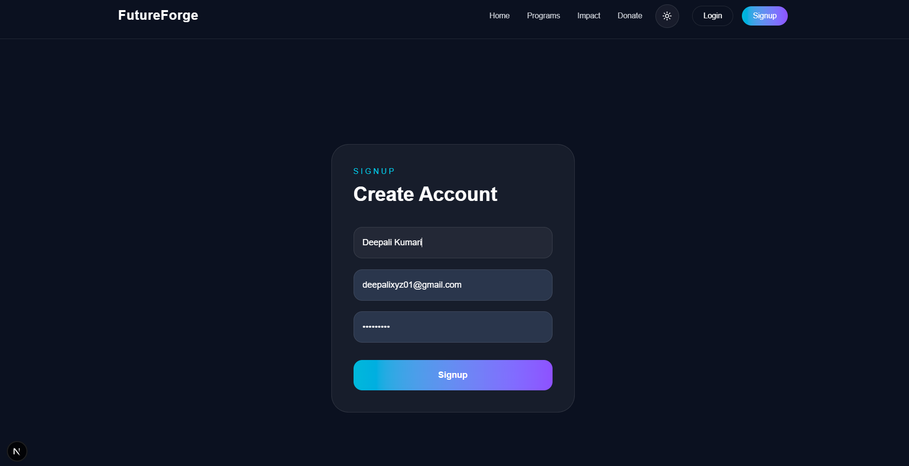
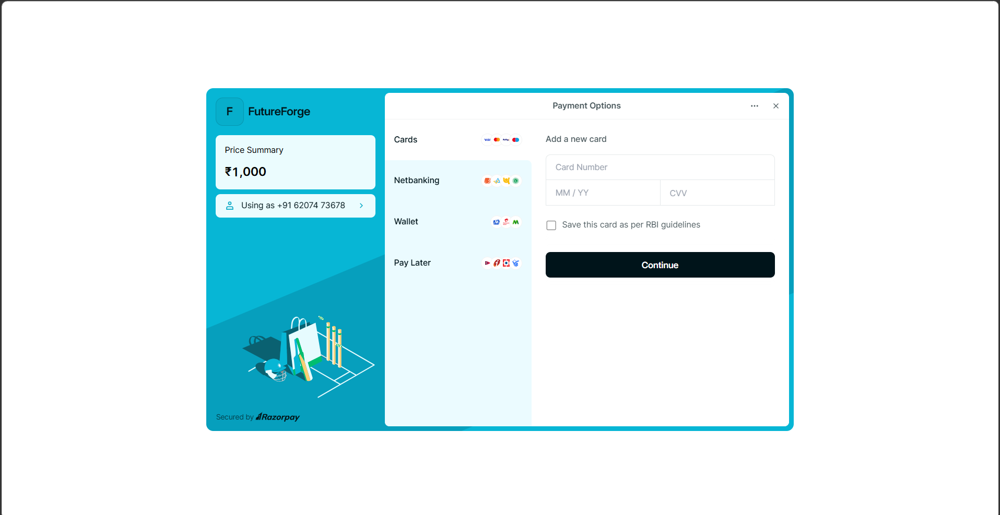

# 🚀 FutureForge

FutureForge is a modern donation and mentorship platform that empowers underprivileged learners through education, technology, and career opportunities.

Built with a futuristic UI and seamless donation experience, FutureForge allows users to explore educational programs, sponsor students, and track impact through an interactive dashboard.

---

# 🌟 Features

- 🔐 User Authentication (Signup/Login)
- 💳 Razorpay Payment Integration
- 📊 Donation Analytics Dashboard
- 🎯 Featured Educational Programs
- 🌙 Modern Dark UI with Responsive Design
- 📈 Impact Statistics Section
- 🔎 Program Search & Categories
- 📱 Fully Responsive Across Devices

---

# 🛠️ Tech Stack

## Frontend
- Next.js
- Tailwind CSS
- Framer Motion

## Backend
- Node.js
- Express.js
- MongoDB
- JWT Authentication

## Payment Gateway
- Razorpay

---

# 📸 Screenshots

## 🏠 Home Page


---

## 📚 Programs Page


---

## 💳 Donation Page


---

## 📊 Dashboard Page



---

## 🌍 Impact Page



---

## 🔐 Signup Page



---

## 💰 Razorpay Integration



---

# 📁 Project Structure

```bash
FUTUREFORGE
│
├── client
│   ├── src
│   ├── public
│   ├── components
│   └── app
│
├── server
│   ├── routes
│   ├── models
│   ├── middleware
│   └── config
│
└── README.md
```

⚙️ Installation

1️⃣ Clone Repository
git clone https://github.com/deepali-kumari-iitp/futureforge.git

2️⃣ Frontend Setup
cd client
npm install
npm run dev

3️⃣ Backend Setup
cd server
npm install
npm run dev

🔑 Environment Variables

Create a .env file inside the server folder and add:
MONGO_URI=your_mongodb_uri
JWT_SECRET=your_secret
RAZORPAY_KEY_ID=your_key
RAZORPAY_SECRET=your_secret

Create a .env.local file inside the client folder and add:
NEXT_PUBLIC_RAZORPAY_KEY_ID=your_key

🎯 Future Improvements
🎓 Mentor Booking System
💬 Real-time Chat Support
🧠 AI-based Program Recommendations
📜 Donation Certificates
🌐 Multi-language Support
👩‍💻 Author

Deepali Kumari
IIT Patna

GitHub: https://github.com/deepali-kumari-iitp

⭐ If you like this project

Give it a ⭐ on GitHub!

